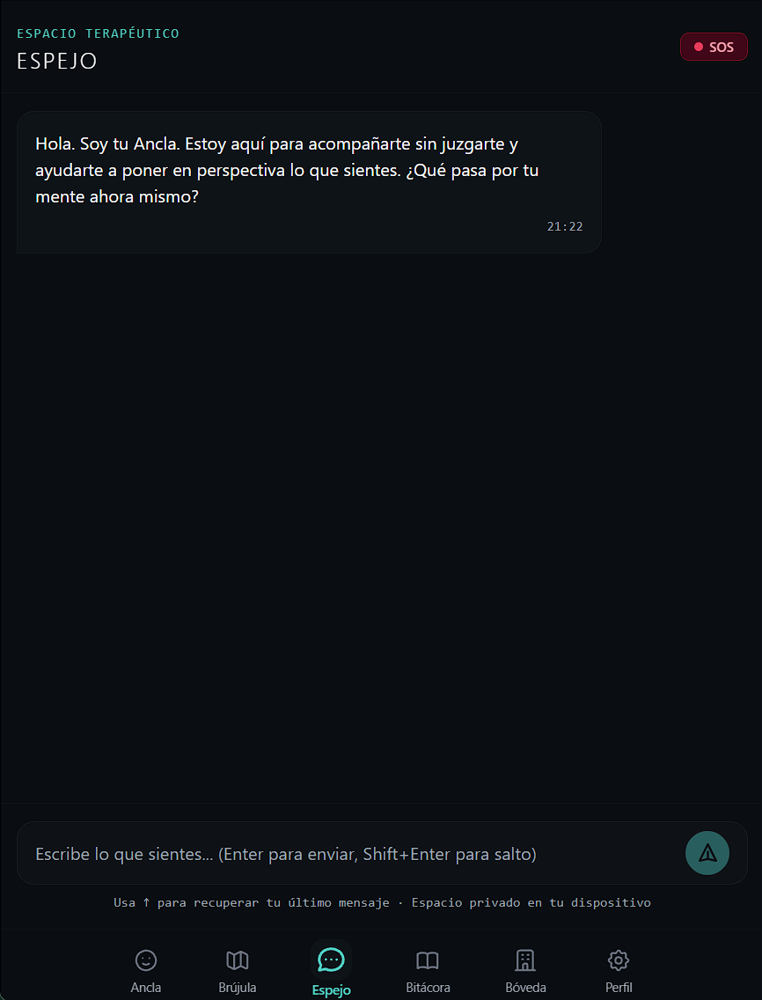
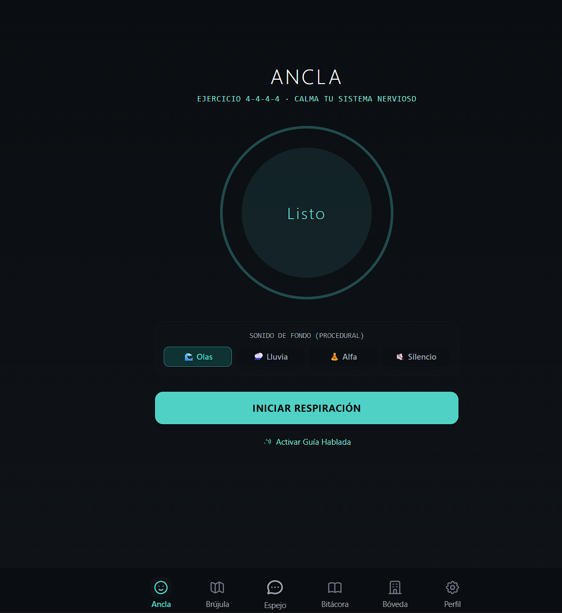
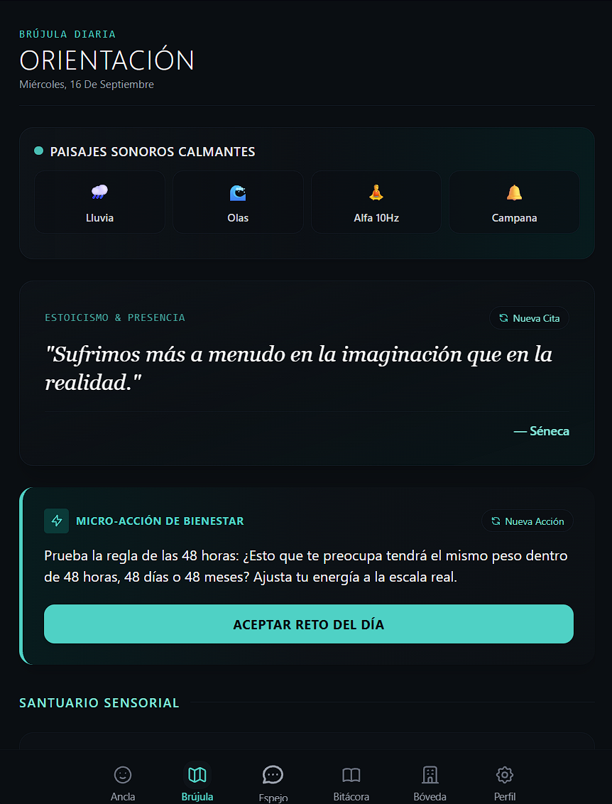
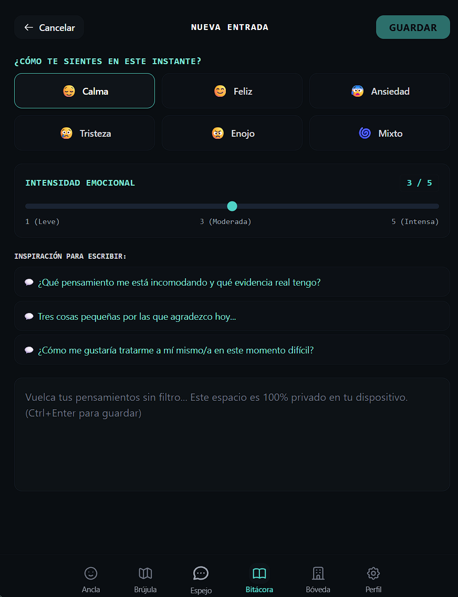
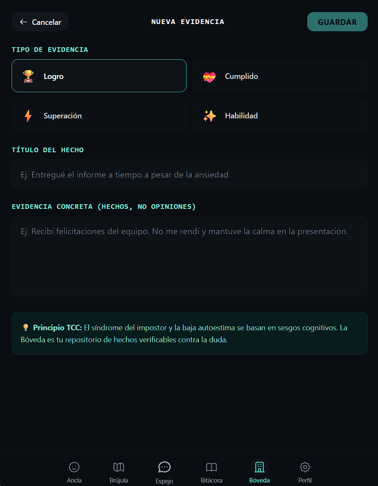

# 🧭 Ancla y Brújula

> **Plataforma Web Progresiva (PWA) de Acompañamiento Emocional y Reestructuración Cognitiva basada en Terapia Cognitivo-Conductual (TCC).**

[](https://anclabu.vercel.app/)
[](https://react.dev/)
[](https://www.typescriptlang.org/)
[](https://tailwindcss.com/)
[](https://vitejs.dev/)
[](https://developer.mozilla.org/es/docs/Web/Progressive_web_apps)
[](LICENSE)

---

## 🌐 Enlace de Producción

🚀 **Acceso directo a la aplicación:** [https://anclabu.vercel.app/](https://anclabu.vercel.app/)

---

## 📖 Índice

- [Visión General y Enfoque Clínico](#-visión-general-y-enfoque-clínico)
- [Módulos del Sistema y Capturas](#-módulos-del-sistema-y-capturas)
  - [1. El Espejo (Chat TCC & Reframing Socrático)](#1-el-espejo-chat-tcc--reframing-socrático)
  - [2. El Ancla (Regulación Somática 4-4-4-4)](#2-el-ancla-regulación-somática-4-4-4-4)
  - [3. La Brújula (Contenido Curado Diario)](#3-la-brújula-contenido-curado-diario)
  - [4. La Bitácora (Diario Emocional e Intensidad)](#4-la-bitácora-diario-emocional-e-intensidad)
  - [5. La Bóveda (Evidencias de Autoestima)](#5-la-bóveda-evidencias-de-autoestima)
  - [6. Perfil, Privacidad y Respaldo](#6-perfil-privacidad-y-respaldo)
- [Arquitectura y Funcionamiento](#-arquitectura-y-funcionamiento)
- [Configuración de API Keys (DeepSeek / Gemini)](#-configuración-de-api-keys-deepseek--gemini)
- [Guía de Instalación y Ejecución Local](#-guía-de-instalación-y-ejecución-local)
- [Despliegue en Vercel](#-despliegue-en-vercel)
- [Instalación como PWA (Móvil y Escritorio)](#-instalación-como-pwa-móvil-y-escritorio)
- [Líneas de Asistencia y Crisis (Ecuador)](#-líneas-de-asistencia-y-crisis-ecuador)
- [Descargo de Responsabilidad](#-descargo-de-responsabilidad)

---

## 🧠 Visión General y Enfoque Clínico

**Ancla y Brújula** es una herramienta de autocuidado y regulación emocional diseñada bajo principios validados de la **Terapia Cognitivo-Conductual (TCC)** y técnicas de **anclaje somático**. 

A diferencia de chatbots convencionales, el sistema implementa:
1. **Indagación Socrática:** En lugar de dar consejos genéricos o validar distorsiones nocivas, guía al usuario a cuestionar la evidencia de sus pensamientos automáticos.
2. **Detección de Sesgos Cognitivos:** Identifica en tiempo real patrones como *catastrofismo*, *pensamiento todo o nada*, *lectura de mente*, *sobregeneralización*, etc.
3. **Privacidad y Filosofía Offline-First:** Toda la información personal, bitácoras y bóvedas se almacenan localmente en el navegador del usuario vía **IndexedDB**, garantizando confidencialidad y operatividad sin conexión a internet.
4. **Respaldo e Interoperabilidad:** Permite exportar e importar la totalidad de los datos en formato JSON estructurado.

---

## 🖼️ Módulos del Sistema y Capturas

### 1. El Espejo (Chat TCC & Reframing Socrático)
Conversación terapéutica con respuestas en streaming (DeepSeek V3 / Gemini 2.0).
- **Detección Automática de Distorsiones:** Etiqueta sesgos detectados con acceso a guías y plantillas de reframing socrático.
- **Historial de Mensajes Rápido:** Presiona `↑` (flecha arriba) en el campo de texto para recuperar el último mensaje escrito.
- **Botón SOS Integrado:** Acceso instantáneo al protocolo de contención y números oficiales de emergencia.



---

### 2. El Ancla (Regulación Somática 4-4-4-4)
Herramienta de respiración cuadrada táctica (Box Breathing: *Inhala 4s, Retén 4s, Exhala 4s, Sostén 4s*).
- **Animación Visual Armónica:** Guía de ritmo continuo y suave.
- **Audio Sintetizado con Web Audio API:** Sonido de cuenco tibetano relajante generado en tiempo real sin requerir archivos de audio pesados.
- **Contador de Ciclos:** Seguimiento de sesiones completadas para fomentar el hábito.



---

### 3. La Brújula (Contenido Curado Diario)
Dosis diaria de perspectiva psicológica generada dinámicamente:
- **Citas Estoicas y TCC:** Frases seleccionadas de autores clásicos y psicoterapeutas.
- **Música y Arte Sugerido:** Estimulación sensorial para el cambio de estado de ánimo.
- **Micro-Retos de Acción:** Pequeñas tareas prácticas para romper la parálisis por análisis.



---

### 4. La Bitácora (Diario Emocional e Intensidad)
Registro estructurado del estado de ánimo:
- Selección de 6 estados emocionales base con selector visual.
- Medición de intensidad de 1 a 5.
- Entrada libre de notas, detonantes y aprendizajes.
- Historial cronológico con filtros y almacenamiento permanente en IndexedDB.



---

### 5. La Bóveda (Evidencias de Autoestima)
Repositorio personal para combatir el síndrome del impostor y la baja autoeficacia.
- Registro categorizado: **Logros 🏆**, **Cumplidos 💝**, **Superaciones 💪** y **Habilidades ✨**.
- Visualización de pruebas tangibles para consultar en momentos de crisis o desánimo.



---

### 6. Perfil, Privacidad y Respaldo
- **Estadísticas de uso:** Días activos, registros en bitácora y ciclos de respiración.
- **Copia de Seguridad Completa:** Exporta tu base de datos local a un archivo `.json` y restáurala en cualquier momento o dispositivo.
- **Limpieza de Datos:** Control total para eliminar conversaciones o registros con confirmación de seguridad.

---

## 🏗️ Arquitectura y Funcionamiento

El código fuente en `app/` sigue una arquitectura limpia en 4 capas desacopladas:

```
app/src/
├── presentation/          # UI: Pantallas (Espejo, Ancla, Brújula, Bitácora, Bóveda, Perfil) y Componentes
├── application/           # Gestión de Estado Global (Zustand: Auth, Journal, Vault, Chat, Content)
├── domain/                # Modelos de Dominio (Types, Interfaces, Constantes de TCC y Contactos)
└── infrastructure/        # Proveedores externos: DeepSeek API, Gemini API, Supabase, IndexedDB
```

---

## 🔑 Configuración de API Keys (DeepSeek / Gemini)

La aplicación soporta tanto **DeepSeek** (recomendado por precisión en TCC y bajo costo) como **Google Gemini**.

### 1. Obtener API Key de DeepSeek
1. Ingresa a [DeepSeek Open Platform](https://platform.deepseek.com/).
2. Inicia sesión o crea una cuenta.
3. Ve a la sección **API Keys** y genera una nueva clave (`sk-...`).

### 2. Obtener API Key de Google Gemini (Alternativa)
1. Ingresa a [Google AI Studio](https://aistudio.google.com/).
2. Haz clic en **Get API key** y copia tu clave.

### 3. Configuración Local (`.env`)
En la carpeta `app/`, crea un archivo `.env` basado en `.env.example`:

```env
# Proveedor de IA Principal (DeepSeek)
VITE_DEEPSEEK_API_KEY=tu_api_key_de_deepseek_aqui

# Proveedor de IA Secundario / Alternativo (Gemini)
VITE_GEMINI_API_KEY=tu_api_key_de_gemini_aqui

# Supabase (Opcional - para sincronización en la nube)
VITE_SUPABASE_URL=https://tu-proyecto.supabase.co
VITE_SUPABASE_ANON_KEY=tu_clave_anon_supabase
```

> **Nota:** Si configuras `VITE_DEEPSEEK_API_KEY`, el motor de chat utilizará automáticamente DeepSeek V3 en streaming; si no está presente, utilizará Gemini 2.0.

---

## 🚀 Guía de Instalación y Ejecución Local

### Prerrequisitos
- **Node.js** v18.0 o superior
- **npm** o **pnpm**

### Pasos de ejecución:

```bash
# 1. Clonar el repositorio
git clone https://github.com/LuzuJ/Ancla-y-Br-jula.git
cd Ancla-y-Br-jula/app

# 2. Instalar dependencias
npm install

# 3. Configurar variables de entorno
cp .env.example .env
# (Edita el archivo .env con tus claves)

# 4. Iniciar servidor de desarrollo
npm run dev
```

La aplicación se abrirá en `http://localhost:5173/`.

### Validaciones y Pruebas:
```bash
# Compilar TypeScript sin emitir
npx tsc --noEmit

# Ejecutar suite de tests unitarios
npm run test

# Construir paquete optimizado para producción
npm run build
```

---

## ☁️ Despliegue en Vercel

1. Sube el repositorio a GitHub.
2. En tu dashboard de [Vercel](https://vercel.com/):
   - **Root Directory:** Selecciona `app` (o deja la raíz si tienes configurado el monorepo).
   - **Framework Preset:** `Vite`.
   - **Build Command:** `npm run build`
   - **Output Directory:** `dist`
3. En **Settings → Environment Variables**, añade:
   - `VITE_DEEPSEEK_API_KEY` = `tu_clave_deepseek`
   - `VITE_GEMINI_API_KEY` = `tu_clave_gemini`
   - `VITE_SUPABASE_URL` = (opcional)
   - `VITE_SUPABASE_ANON_KEY` = (opcional)
4. Haz clic en **Deploy**.

---

## 📱 Instalación como PWA (Móvil y Escritorio)

La app está certificada como PWA instalable con funcionamiento offline integral:

- **Android (Chrome / Brave / Edge):** Pulsa en el menú (tres puntos) → *"Agregar a la pantalla principal"* o *"Instalar aplicación"*.
- **iOS (Safari):** Pulsa el botón *Compartir* (icono con flecha) → *"Agregar al inicio"*.
- **Escritorio (Chrome / Edge):** Haz clic en el icono de instalación en el extremo derecho de la barra de direcciones.

---

## 🆘 Líneas de Asistencia y Crisis (Ecuador)

Si estás pasando por un momento abrumador o necesitas atención médica y psicológica profesional e inmediata en **Ecuador**, comunícate con estos servicios públicos gratuitos y confidenciales:

| Servicio | Número / Contacto | Cobertura |
|---|---|---|
| **Salud Mental MSP** | **171 (Opción 6)** | Nacional · 24/7 · Gratuito |
| **Emergencias Nacionales** | **911** | Nacional · Inmediato |
| **Apoyo Psicológico / Violencia** | **1800 DELITO (335486)** | Nacional · Gratuito |
| **Cruz Roja Ecuatoriana** | **(02) 2582 482** | Nacional · Atención en crisis |
| **Línea Telefónica Ánimo** | **(04) 2596 600** | Lunes a Viernes · Guayas / Nacional |

---

## ⚠️ Descargo de Responsabilidad

**Ancla y Brújula** es una aplicación diseñada exclusivamente con fines psicoeducativos, de autorreflexión y apoyo al bienestar personal. **No es un servicio médico, no proporciona diagnósticos clínicos ni reemplaza el tratamiento, psicoterapia o intervención de un profesional de la salud mental certificado.**

Si presentas ideación suicida, crisis severa o riesgo para tu integridad, acude inmediatamente al centro de salud o servicio de urgencias más cercano.

---

## 📄 Licencia

Este proyecto está bajo la Licencia [MIT](LICENSE).

💙 *Construido para brindar calma, claridad y herramientas de reflexión accesibles para todos.*
